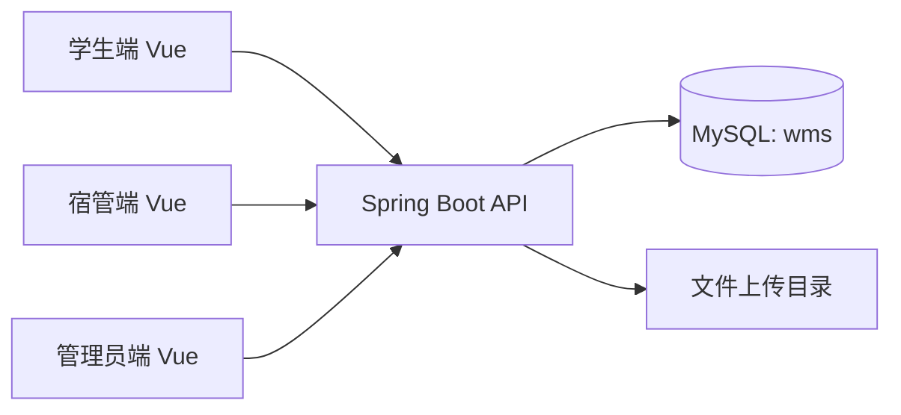

# DormLink - 宿舍管理系统 | Dormitory Management Platform

🔥 A dormitory management system based on Spring Boot + Vue + MyBatis-Plus.  
🚀 Built for campus multi-role workflows including student allocation, repair, room transfer, visitor registration, and notices.  
⭐ Supports admin, dorm manager, and student operations with dashboard statistics.

<p align="center">
  面向校园宿舍业务的前后端分离系统（管理员 / 宿管 / 学生）
</p>

## 项目主周期（Main Timeline）

- 当前工程化加固周期：`2026-04`
- 近期迭代重点：`流程一致性 + 可复现环境 + 自动化测试 + 离线评估`

---

## 目录

- [1. 项目概述](#1-项目概述)
- [2. 功能全景（按角色）](#2-功能全景按角色)
- [3. 核心业务流程](#3-核心业务流程)
- [4. 技术架构与分层说明](#4-技术架构与分层说明)
- [5. 项目结构](#5-项目结构)
- [6. 快速开始](#6-快速开始)
- [7. 配置与数据库初始化](#7-配置与数据库初始化)
- [8. 测试与质量保障](#8-测试与质量保障)
- [9. 项目管理与评估](#9-项目管理与评估)
- [10. 已知问题与优化方向](#10-已知问题与优化方向)
- [11. License](#11-license)

---

## 1. 项目概述

`DormLink` 用于宿舍业务流程数字化管理，覆盖以下核心场景：

- 学生、宿管、管理员三角色登录与信息管理
- 宿舍楼、房间与床位资源管理
- 报修工单创建、处理与统计
- 调宿申请、审批与床位调整
- 访客登记与公告发布
- 首页统计看板

系统采用 B/S 架构，后端负责 API 与业务逻辑，前端负责页面交互与可视化。

---

## 2. 功能全景（按角色）

### 2.1 学生端

- 登录与个人信息维护
- 查看宿舍信息
- 提交报修申请
- 提交调宿申请
- 查看申请处理状态

### 2.2 宿管端

- 负责楼栋内房间与床位管理
- 处理报修单
- 审核调宿申请
- 管理访客登记

### 2.3 管理员端

- 系统用户管理（学生/宿管）
- 宿舍楼与房间资源管理
- 公告发布与治理
- 全局统计查看

### 2.4 能力矩阵（简版）

| 模块 | 学生 | 宿管 | 管理员 |
|---|---|---|---|
| 账号登录 | 登录 | 登录 | 登录 |
| 宿舍资源 | 查看 | 管理 | 管理 |
| 报修流程 | 提交/查看 | 处理 | 监督 |
| 调宿流程 | 提交/查看 | 审核 | 监督 |
| 访客登记 | - | 管理 | 管理 |
| 公告管理 | 查看 | 查看 | 发布/管理 |

---

## 3. 核心业务流程

### 3.1 报修流程

1. 学生提交报修单。
2. 系统自动补齐默认状态（`未完成`）与创建时间。
3. 宿管处理后更新状态；状态为 `完成` 时自动补齐完成时间。
4. 系统校验时间顺序，避免“完成时间早于创建时间”的脏数据。

### 3.2 调宿流程

1. 学生提交调宿申请。
2. 系统阻断同人同源/目标房间的重复未处理申请。
3. 宿管审批通过后执行床位迁移。
4. 学生可在驳回后重新发起新申请。

---

## 4. 技术架构与分层说明



后端分层：

- `controller`：接口入口与参数接收
- `service`：业务规则与流程编排
- `mapper`：MyBatis-Plus 数据访问
- `entity`：领域模型

---

## 5. 项目结构

```text
DormLink
├── Dormitory_business/                 # Spring Boot 后端
│   ├── src/main/java/com/example/springboot
│   │   ├── controller/
│   │   ├── service/
│   │   ├── mapper/
│   │   ├── entity/
│   │   └── common/
│   └── src/test/java/...              # 单元测试
├── vue/                                # Vue 前端
├── db/init.sql                         # 建表 + 种子数据
├── scripts/dev.sh                      # 本地开发命令入口
├── scripts/evaluation/repair_metrics.py
├── evaluation/repair_kpi_dataset.sample.json
├── docs/resume-upgrade-checklist.md
└── project-management/2026Q2_ACTIVITY_LOG.md
```

---

## 6. 快速开始

### 6.1 环境准备

- JDK 11
- Maven 3.8+
- Node.js 16+
- MySQL 8.x
- Python 3.10+
- Docker（可选，用于本地 MySQL/Redis）

### 6.2 初始化配置

```bash
cp .env.example .env
./scripts/dev.sh check-env
```

### 6.3 初始化数据库

```bash
mysql -u root -p < db/init.sql
```

### 6.4 启动服务

```bash
# 1) 启动基础设施（可选）
./scripts/dev.sh infra-up

# 2) 启动后端
./scripts/dev.sh backend

# 3) 启动前端
./scripts/dev.sh frontend
```

---

## 7. 配置与数据库初始化

后端读取以下关键配置（`Dormitory_business/src/main/resources/application.properties`）：

- `SERVER_PORT`（默认 `9090`）
- `DB_URL`
- `DB_USERNAME`
- `DB_PASSWORD`

数据库名默认：`wms`。  
`db/init.sql` 已包含：

- 全量业务表结构（admin/student/dorm_room/repair/adjust_room/visitor/...）
- 可登录的基础账号与演示数据

---

## 8. 测试与质量保障

### 8.1 后端单元测试

```bash
cd Dormitory_business
mvn -B -ntp test
```

当前已覆盖：

- 调宿重复申请拦截
- 调宿默认字段补全与手动字段保留
- 报修状态流转一致性（默认值、完成时间补全、时间顺序校验）

### 8.2 离线 KPI 评估（样例）

```bash
./scripts/dev.sh eval-repair
# 或
python3 scripts/evaluation/repair_metrics.py
```

输出指标包括：

- CompletionRate
- OnTimeCompletionRate
- AvgCompletionHours
- PendingOverdueRate
- AvgFeedbackScore

---

## 9. 项目管理与评估

- 改造清单：`docs/resume-upgrade-checklist.md`
- 业务流程图：`docs/business-flows.md`
- 活动记录：`project-management/2026Q2_ACTIVITY_LOG.md`
- 评估样例：`evaluation/repair_kpi_dataset.sample.json`

---

## 10. 已知问题与优化方向

- 接入 Spring Security + JWT，替代当前轻量登录方案
- 增加权限访问与异常分支集成测试
- 增加审计日志（关键审批操作留痕）
- 增加报修评价闭环（评分与文本反馈）
- 增加导出报表能力（楼栋报修、调宿效率等）

---

## 11. License

MIT License，详见 [LICENSE](LICENSE)。
