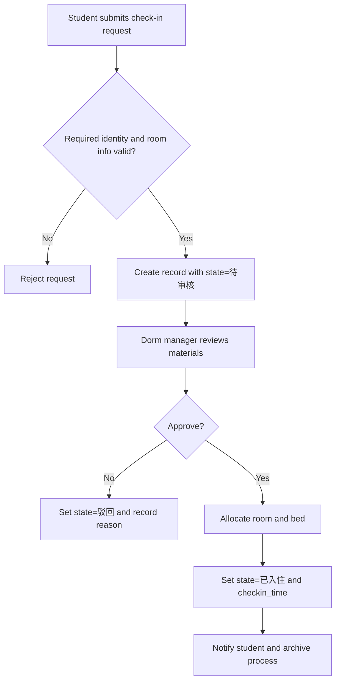
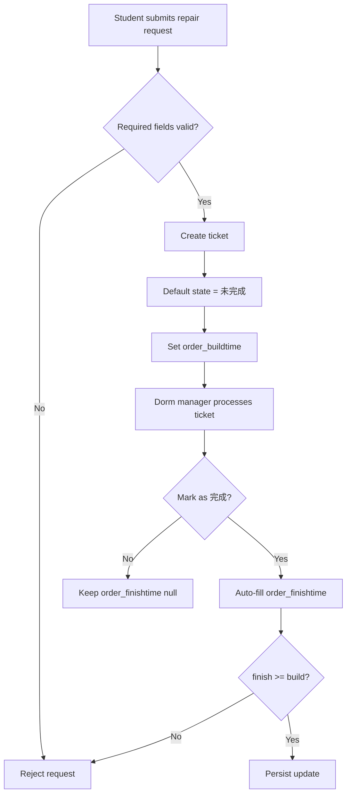
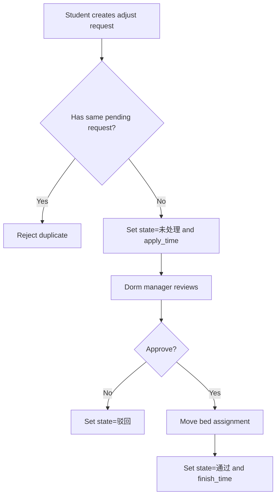

# DormLink Business Flows

## 0. Multi-Role Closed-Loop Overview

- Student: submit check-in, room adjustment, and repair requests.
- Dorm manager: review requests and process tickets.
- System: enforce state transitions and persist timestamps.
- Closed-loop entry: student request submission.
- Closed-loop exit: approved/rejected result with traceable timestamps.

## 1. Check-In Workflow

## 2. Repair Workflow

## 3. Room Adjustment Workflow

## 4. State and Handover Rules

### 4.1 Check-In State Set

- `待审核`: request created and waiting dorm manager review.
- `驳回`: material not qualified, student can resubmit.
- `已入住`: room and bed assigned, process closed.

### 4.2 Repair State Set

- `未完成`: ticket accepted and pending process.
- `完成`: processing finished with valid finish timestamp.

### 4.3 Adjustment State Set

- `未处理`: request accepted and pending manager action.
- `驳回`: manager rejected the adjustment.
- `通过`: bed migration completed and timestamp recorded.
