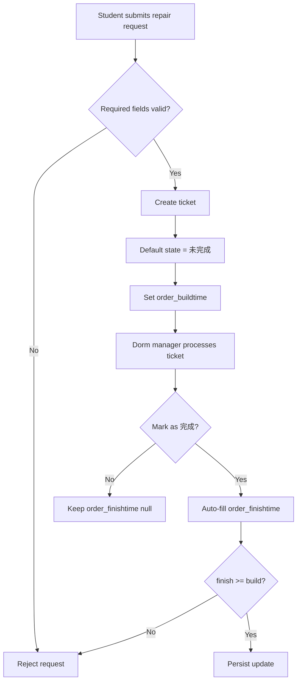
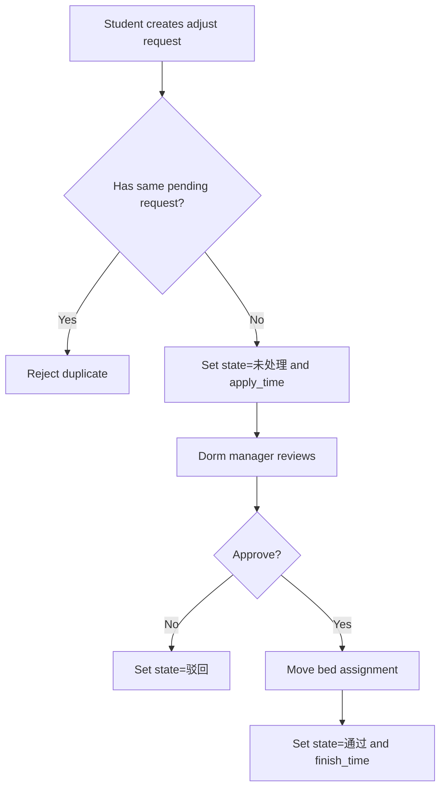

# DormLink Business Flows

## 1. Repair Workflow

```mermaid
flowchart TD
  A[Student submits repair request] --> B{Required fields valid?}
  B -- No --> X[Reject request]
  B -- Yes --> C[Create ticket]
  C --> D[Default state = 未完成]
  D --> E[Set order_buildtime]
  E --> F[Dorm manager processes ticket]
  F --> G{Mark as 完成?}
  G -- No --> H[Keep order_finishtime null]
  G -- Yes --> I[Auto-fill order_finishtime]
  I --> J{finish >= build?}
  J -- No --> X
  J -- Yes --> K[Persist update]
```

## 2. Room Adjustment Workflow

```mermaid
flowchart TD
  A[Student creates adjust request] --> B{Has same pending request?}
  B -- Yes --> X[Reject duplicate]
  B -- No --> C[Set state=未处理 and apply_time]
  C --> D[Dorm manager reviews]
  D --> E{Approve?}
  E -- No --> F[Set state=驳回]
  E -- Yes --> G[Move bed assignment]
  G --> H[Set state=通过 and finish_time]
```
